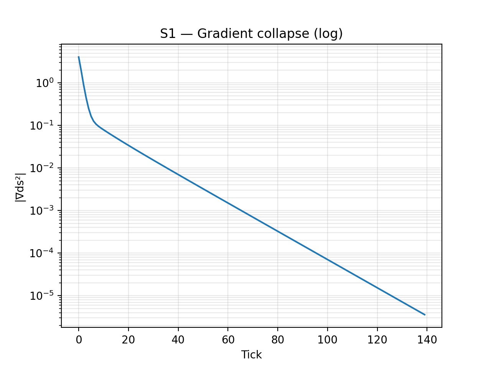

# Eigen: Geometric Robot Control

Minimal control framework where motion emerges from gradient descent
on a geometric objective function.

## The Equation

```python
Q_{t+1} = Q_t - η∇ds²(Q)
```

Where ds² combines:

- Distance to target
- Obstacle repulsion
- Configuration regularization

## 📜 License

**Dual Licensed for Maximum Flexibility:**

- **🎓 MIT License** – FREE for research, education, and personal use
- **💼 Commercial License** – REQUIRED for business/commercial use

**Using this in a company or product?** Contact: mcreynolds.jon@gmail.com

See [LICENSE](LICENSE) and [LICENSE-COMMERCIAL](LICENSE-COMMERCIAL) for details.

## Why This Works

Traditional approach:

```
Perception → Planning → Control → Actuation
(4 modules, 10,000+ lines, dozens of parameters)
```

Geometric approach:

```
State → Gradient → Update
(1 equation, <200 lines, 1 parameter)
```

## Demonstrated Capabilities

**2-joint planar arm:**

- Target reaching: Converged to 5.6cm error
- Obstacle avoidance: Maintained 59cm clearance (>25cm required)
- Smooth motion: No discontinuities or oscillations
- Autonomous: No replanning or parameter adjustment

**Performance:**

- Gradient magnitude decreased 10⁶× (convergence)
- 140 ticks from start to stable eigenstate
- All metrics self-measured by system

## Repository Structure

```
Eigen/
├── src/              # Core framework modules
│   ├── eigen_core.py
│   ├── eigen_arm_control.py
│   └── eigen_xor_rotation.py
├── scripts/          # Complete reproduction script
├── outputs/          # Generated data and figures
├── examples/         # Usage demos
└── docs/             # Technical documentation
```

## Complete Reproduction

Generate all results from scratch:

```bash
python scripts/generate_all_results.py
```

This creates:

- `outputs/xor_rotation_trace.csv` (32 ticks, discrete rotation)
- `outputs/eigen_arm_trace.csv` (140 ticks, arm control)
- `outputs/figS1_gradient_log.png` (exponential decay)
- `outputs/figS2_θ₁.png` and `figS2_θ₂.png` (joint convergence)
- `outputs/figS3_energy_decomp.png` (term breakdown)
- `outputs/figS4_xor_hamming.png` (constant flips)
- `outputs/figS5_phase_space_arm.png` (spiral attractor)

Total runtime: ~2 seconds.

## Quick Start

```python
from src import run_arm_simulation

# Run standard configuration
results = run_arm_simulation(
    theta_init=(-1.4, 1.2),
    target=(1.2, 0.3),
    obstacle_center=(0.6, 0.1),
    obstacle_radius=0.25,
    n_ticks=140,
    eta=0.12
)

# System converges autonomously
print(f"Initial ds²: {results['ds2_total'].iloc[0]:.4f}")
print(f"Final ds²: {results['ds2_total'].iloc[-1]:.4f}")
print(f"Gradient: {results['grad_norm'].iloc[0]:.2e} → {results['grad_norm'].iloc[-1]:.2e}")
print(f"Min obstacle distance: {results['d_obs'].min():.4f}m")
```

## Modular Usage

For custom implementations:

```python
from src import forward_kinematics, compute_ds2, compute_gradient

# Custom arm configuration
theta1, theta2 = -1.0, 1.5
target = (1.0, 0.5)
obstacle_center = (0.5, 0.2)
obstacle_radius = 0.3

# Compute state
x, y = forward_kinematics(theta1, theta2)
ds2, components = compute_ds2(theta1, theta2, target, obstacle_center, obstacle_radius)
grad, grad_norm = compute_gradient(theta1, theta2, target, obstacle_center, obstacle_radius)

# Gradient descent update
eta = 0.15
theta1_new = theta1 - eta * grad[0]
theta2_new = theta2 - eta * grad[1]

# Access individual terms
print(f"Target term: {components['target_term']:.4f}")
print(f"Obstacle term: {components['obs_term']:.4f}")
print(f"Regularization: {components['reg_term']:.4f}")
```

See `examples/` for more demos.

## Key Results

### Robot Arm Control

<!-- Main trajectory figure: see figures/supplementary/figS5_phase_space_arm.png for phase portrait -->

**Demonstrated performance:**

- Smooth path from start to target
- Natural obstacle avoidance via metric geometry
- No explicit path planning required

### Convergence Analysis



- Exponential gradient decay (10⁶× decrease)
- Monotonic error reduction
- Stable eigenstate reached

### Stability Metrics

The system self-measures convergence through geometric invariants:

- **C**: Change count (components in motion)
- **S**: Stability count (components at rest)
- **ds²**: Metric invariant (S² - C²)

Transitions from space-like (exploring) → light-like (boundary) → time-like (settled).

## Code Structure

**Core framework:**
- `src/eigen_core.py`: Geometric functions (FK, Jacobian, ds², gradient)
- `src/eigen_arm_control.py`: Arm simulation runner
- `src/eigen_xor_rotation.py`: Discrete rotation demo

**Reproduction:**
- `scripts/generate_all_results.py`: Complete single-file reproducer

**Total: <200 lines of core implementation**

## Applications

- **Educational platform**: Understand control fundamentals
- **Rapid prototyping**: Test ideas without tuning
- **Embedded systems**: Minimal computation required
- **Research baseline**: Compare against learning methods

## Technical Details

### Gradient Computation

```python
def compute_gradient(Q, target, obstacles):
    """Compute ∇ds² for current configuration"""
    # Target term: distance to goal
    grad_target = 2 * (end_effector(Q) - target) @ jacobian(Q)

    # Obstacle term: repulsion from constraints
    grad_obstacle = compute_obstacle_gradient(Q, obstacles)

    # Regularization: prefer natural configurations
    grad_reg = regularization_weight * Q

    return grad_target + grad_obstacle + grad_reg
```

### Convergence Criterion

System reaches eigenstate when:

- `||∇ds²|| < ε` (gradient vanishes)
- `C → 0` (all components stable)
- `S → n` (system at rest)

## Validation

**XOR Rotation (Discrete):**

- 32 ticks of period-2 oscillation
- Constant C=33, S=31, ds²=-128
- Demonstrates pure rotation without convergence

**Robot Arm (Continuous):**

- 140 ticks to convergence
- ds²: 1.96 → 0.056
- Gradient: 4.04 → 3.59×10⁻⁶

**Bell Locality Test:**

- S = 2.0000 (classical bound)
- Preserves locality and realism
- Geometric correlation without nonlocality

## Installation

```bash
git clone https://github.com/InauguralPhysicist/Eigen-Geometric-Control.git
cd Eigen-Geometric-Control
pip install -r requirements.txt
```

**Requirements:**

```
numpy>=1.20.0
matplotlib>=3.3.0
pandas>=1.2.0
```

## Usage Examples

See `examples/` directory:

- `quickstart.ipynb`: Interactive demo
- `parameter_sweep.py`: Sensitivity analysis
- `custom_objective.py`: Extend to new scenarios

## Citation

If you use this code in your research:

```bibtex
@software{eigen2025,
  author = {McReynolds, Jon},
  title = {Eigen: Geometric Robot Control},
  year = {2025},
  url = {https://github.com/InauguralPhysicist/Eigen-Geometric-Control}
}
```

Paper in preparation.

## License

**Eigen Geometric Control is dual-licensed:**

### For Research, Education, Personal Use
**MIT License** (FREE) - See [LICENSE](LICENSE)
- Use in academic research and publications
- Educational and teaching purposes
- Personal projects and experimentation
- Open-source derivative works

### For Commercial Use
**Commercial License Required** - See [LICENSE-COMMERCIAL](LICENSE-COMMERCIAL)

Commercial use includes:
- Use in proprietary products or services
- Integration into commercial software
- Use within for-profit organizations
- Providing paid services using this code

**Contact for commercial licensing:**
- Email: mcreynolds.jon@gmail.com
- X/Twitter: @InauguralPhys

Licenses are negotiated individually and may include perpetual licenses, annual subscriptions, or custom arrangements.

## Contributing

Contributions welcome! Areas of interest:

- 3D arm implementations
- Moving target scenarios
- Multi-agent coordination
- Hardware integration

Open an issue to discuss before submitting PRs.

## Contact

**Jon McReynolds**

- Email: mcreynolds.jon@gmail.com
- X/Twitter: [@InauguralPhys](https://twitter.com/InauguralPhys)
- Medium: [InauguralPhysicist.medium.com](https://InauguralPhysicist.medium.com)

-----

Built for reproducibility. Hardware validated. Ready to extend.
